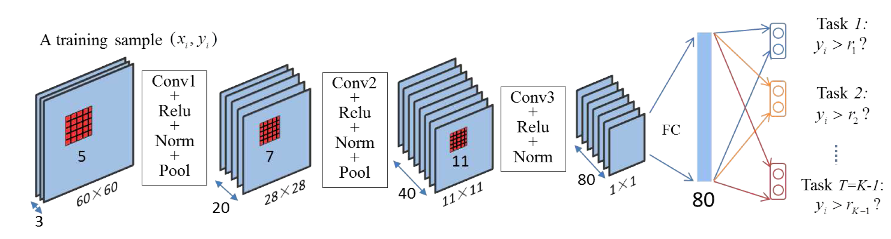

# 年龄识别笔记
##1，对参考论文[Ordinal Regression with Multiple Output CNN for Age Estimation](http://www.cv-foundation.org/openaccess/content_cvpr_2016/papers/Niu_Ordinal_Regression_With_CVPR_2016_paper.pdf)理解
1. 简介：
该论文是2016年最新的一篇关于年龄识别的论文。它的主要贡献在于提出了一种新的**结合深度学习网络和回归模型的端到端的学习方法**进行年龄识别，该方法既没有传统年龄识别方法需要手动构造特征进行学习过程的繁琐，又没有一些深度学习网络的庞大，它通过仅仅3层卷积层和一个全连接层就实现快速而准确地年龄识别过程。同时该论文还构造了一个新的年龄数据库**AFAD（Asian Face Age Dataset）**，从人人网上爬下了约164,432张人脸图，年龄分布从15岁到40岁，其中有63,680张女性人脸图以及100,752张男性人脸图。
2. Ordinal Regression with CNN：
* 问题构建：
首先假设输入的第i张图片用${x}_{i} \in \chi$来表示，而输出结果用${y}_{i} \in \gamma = \{{r}_{1}, {r}_{2},...,{r}_{k}\}$来表示，其中${r}_{k} \succ {r}_{k-1} \succ ... \succ{r}_{1}$， 符号$\succ$标示着两个不同级别的顺序。给定训练样本${D} = \{{x}_{i}, {y}_{i}{\}}_{i = 1}^{N}$，ordinal regression就是要找到一个函数映射关系$h(.):\chi \rightarrow \gamma$，目标则是将自定义的代价函数$R(h) = c : \chi \times \gamma \rightarrow R$最小化。
其中代价矩阵$C$被用来计算预测到的等级序列与实际的等级序列的误差。其中， $C$是一个$K \times K$的矩阵，而${C}_{y, r}$代表着预测某个样本$(x, y)$的等级序列$r$
  * 提出方法：
在本文中，为了直接利用已经拥有的分类算法，作者将ordinal regression转化为了一系列的二分类子问题。更明确的说就是将一个拥有K个等级的ordinal regression问题转化为了K - 1个更加简单的二分类子问题。对于每一个输出等级${r}_{k} \in \{r_1, r_2, ..., r_{K-1}\}$， 其中每一个二分类器都用来预测输出$y_i$是否高于等级$r_k$。最后根据这K-1个二分类器的输出结果判定最后的预测等级。
应用到年龄识别这个特定问题上就是：输出$y_i$的年龄值原本为1-100岁，现在将这个问题转化为100个子问题，判断该样本图片预测年龄是否大于$i \in \{1, 2, 3, ..., 100\}$岁，若大于i，则该子问题输出为1，否则为0。最后根据所有的100个子问题的输出结果计算预测年龄，其计算公式为：
$predict\_age = 1 + \sum_{k=1}^{K-1}{f}_{k}(x^,)$
* CNN体系结构 
* 损失函数的计算：
因为作者提出的方法是基于caffe的深度学习框架的网络，而且是一种多任务的计算模型，在caffe的源码中并没有这样的layer定义，所以需要我们自己构建自定义的loss_layer来计算。其核心公式如下：
我们有N个训练样本，对于子问题中的某一个问题来说，我们采用cross-entropy函数用作损失函数，则最后的损失函数为
$E_s = -\frac{1}{N}\sum_{i=1}^{N}(1\{o_i = y_i\}w_ilog(p(o_i|x_i, W))$
但是我们有K=100个子任务，所以我们最后的损失函数公式为
$E_m = -\frac{1}{N}\sum_{i=1}^{N}\sum_{t=1}^{T}(\lambda^t1\{o_i^t = y_i^t\}w_i^tlog(p(o_i^t|x_i, W^t)))$
其中$\lambda^t$代表着第t个子任务的数据权重，也就是每个年龄数据量在总数据量中的比重，其计算公式为$\lambda^t = \frac{\sqrt{N_t}}{\sum_{i=1}^{T}{\sqrt{N_i}}}$
而$w_i$则代表着带每一个二分类子问题中每一个类别的权重，可以简单地设为1。
最后再利用反向梯度传播来实现参数最优化。
3. 图像预处理
该论文作者对用于训练的图像做了如下预处理过程
* 检脸器检脸
* 根据检脸框用AAM做标点
* 根据眼睛标点结果做一个简单的脸部矫正
* 根据矫正后的图片裁剪一个64*64的人脸图片，保证鼻尖点位于裁剪图片的中心
* 为了防止过拟合的情况，从64*64的人脸图片中随机裁剪一个60*60的人脸图，用于最后的输入。
4. 实验结果分析
该论文在morph数据库和AFAD数据库上分别做了对比试验，其中利用提出的方法得到的最好结果的MAE是在morph上的3.27岁，在AFAD数据集上的最好结果是3.34岁。同时也做了彩色图和灰度图的对比试验，结果显示彩色图比灰度图mae小大约0.1岁左右。
但是由于论文中用于训练的数据中年龄分布缺少15岁以下的图片，所以其实用性有待验证。

----------

##2，训练过程
###（1），年龄数据集的准备
为了产生更大的数据量和更广泛更均匀的数据分布，我采用多个数据集混合训练的方法进行训练及测试过程。现在网上有的年龄数据库有imdb（含有大约46万张图片），wiki（含有大约62000张图片），但是这两个数据库中的标签不太准确，含有大量的噪声数据，筛选过程比较麻烦。fg-net（只有约1000张图片），morph（有大约65000张图片），外加新增的Tutu1-15（主要收集了其他数据库缺乏的1-15岁小孩的图片数据，每个年龄有大约1500张图片，由Tutu公司构建）。
###（2），图片预处理
原论文中进行了人脸矫正以及随机crop的过程，而我在实际训练过程中简化了步骤，只做了一步检脸过程，直接用检脸器产生的脸部数据resize到60*60，然后将数据进行简单的归一化，即将每张图片数据中的像素值减去128后再除以128，是输入数据归一化到-1~1，最后将数据保存为hdf5数据进行训练过程。
###（3），自定义loss_layer
一共需要自定义两个layer，其中一个是loss_layer用于计算多任务的损失函数，另一个是用于计算实际年龄误差的mae_layer层。这两个自定义层的源代码保存在OrdinalRegerssion的文件夹中。（具体添加过程见文件夹中README.md）
###（4），训练
定义训练网络文件及solver文件，该文件保存在train文件夹中。修改train.prototxt中的data层的数据路径以及loss层的weight_file权值文件就可以开始训练。其中loss层的weight_file参数代表着每个年龄段的权重，用于最后的损失函数计算过程。
###（5），自我训练结果评价
* 直接采用检脸后的数据进行训练出现了过拟合的情况，后来加入了人脸矫正的过程可以解决这个问题，同时在实际测试中对检脸程序的一致性要求极高，检脸参数设置稍微不同都会导致结果的极大误差，这都证明了我对数据预处理过程的粗糙。同时也证明了论文中人脸矫正以及随机crop过程的重要性
* 直接采用灰度图进行训练，因为彩色图和灰度图最终得到的实验结果误差相差不大，而灰度图可以适应更广泛极端的情况，所以在实际使用中最好使用灰度图训练及测试。
* 输入数据分布尽量均匀效果会更好，在混合所有的训练数据后，训练误差和测试误差都可达5岁以内，验证集mae误差也能达到5岁。但是在实测情况中出现对16-30对之间的人的年龄预判出错，分析其原因一是因为年龄数据集中的人物年龄分类不准，而是东方人与西方人年龄与面向的不同。说明了数据集对于训练结果的重要性。若要改善，需要重构数据集。